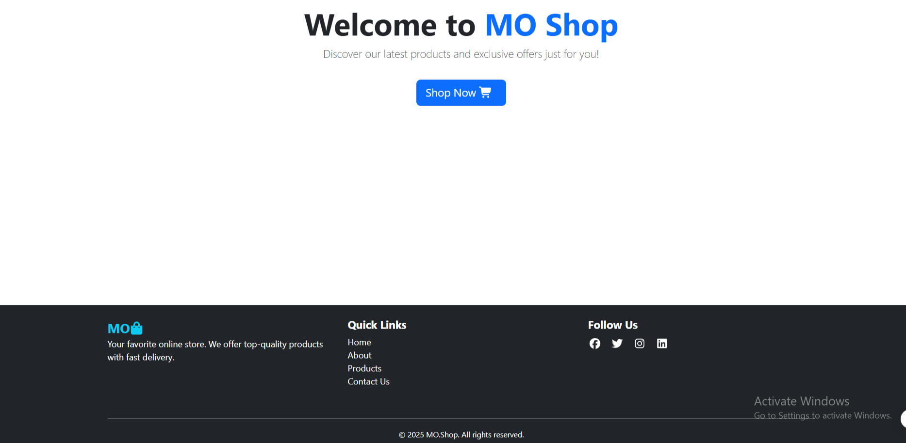
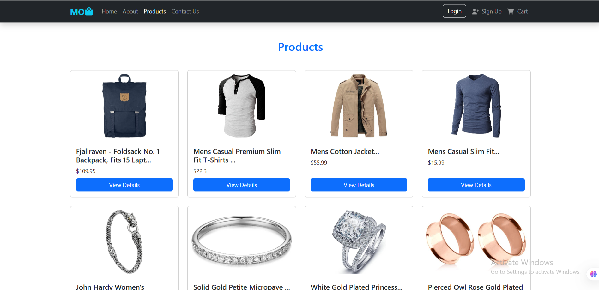

# MO.Shop - E-commerce Website

A simple and responsive e-commerce website built with React. Users can browse products, add them to a cart, and navigate between pages like Home, About, Login, and Contact.

## Live Demo

> [View the website](https://your-live-site-url.com)

---

## Pages Overview

### Home

Product cards with title, price, image, "On Sale" badge, and "Add to Cart" button.

#### Part 1

#### Part 2

#### Part 3

### About

Introduction about the MO.Shop idea or team.

#### Part 1

#### Part 2

### Products

Introduction Products with image and price and more

#### Part 1

##### Part 2

### Contact

A working form with input validation (name, email, message).

### Login & Sign Up

Form validation + data saved to localStorage.

##### Login

##### Sign Up

### Card Details

Displays items with it Details.

### Cart

Displays items added with remove button.

##### Part 1

##### Part 2

##### Part 3

---
